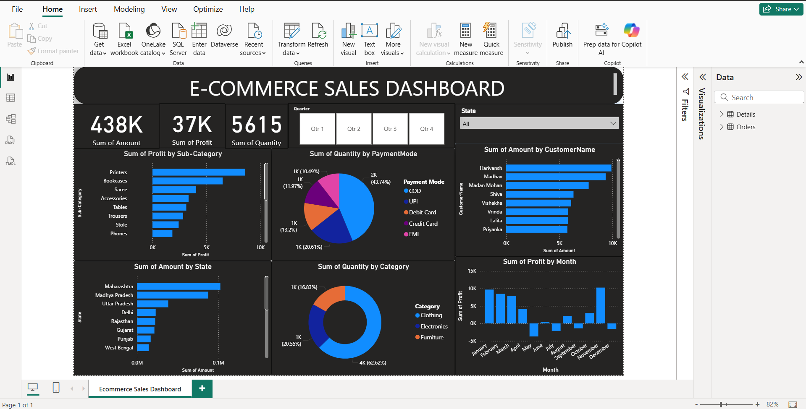

# E-Commerce-Sales-Dashboard

E-Commerce Sales Dashboard is a project in which a dashboard is created for the analysis of the sales of the product of the organization and through this it will help the organizaiton to make decision in the future 
on the particular product and also help to see the particular product sales in the day/month/year and you can also view the sales of the product in the different regions in the country.

## Tech Stack

 Power BI

## Usage
1. Import Both the CSV files(details, orders) into the Power BI through the Import Excel.
2. Now Cleaning the data into the Power BI Query Editor.
3. In Cleaning you have to clean the data like remove the blank space in table and replace it with the 0 value, correct the format of data and After cleaning click on Apply and Change.
4. After Cleaning data you CSV files load in Data Section in right corner of the Pane.
5. Now you can create the Dashboard at you own.

## Screenshot of Dashboard

